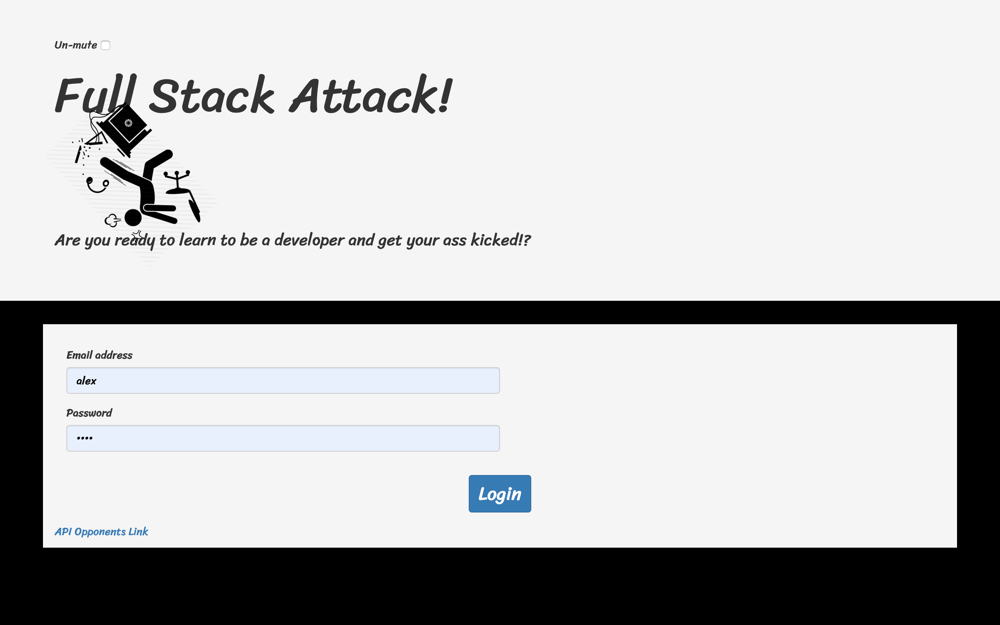
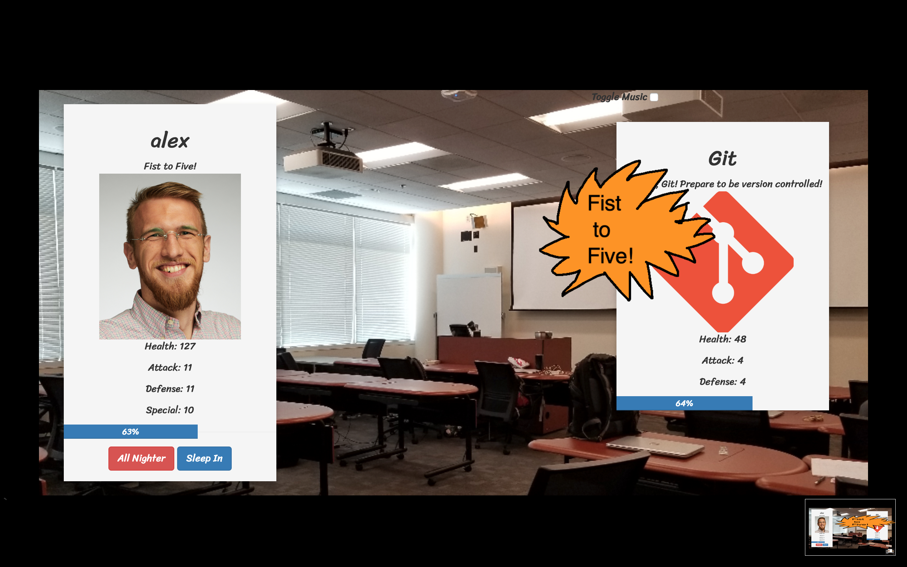
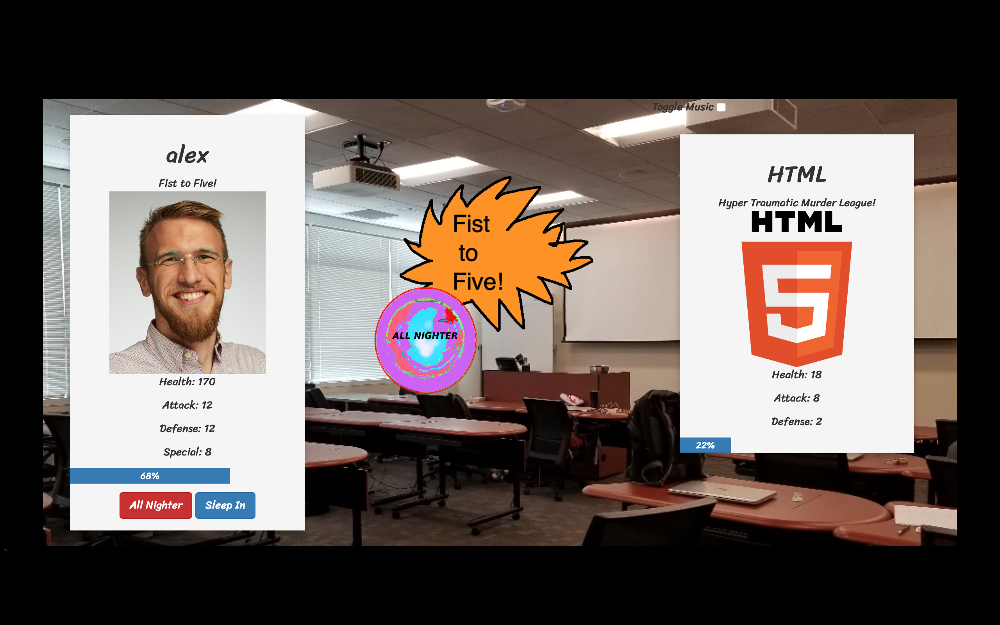
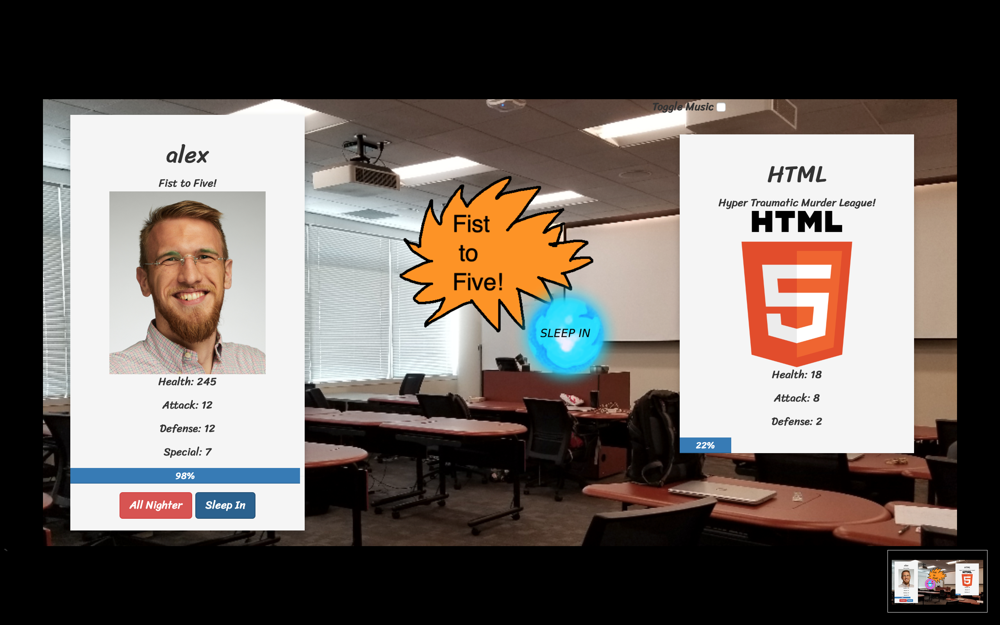
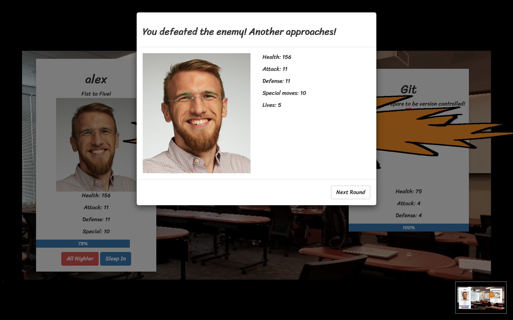
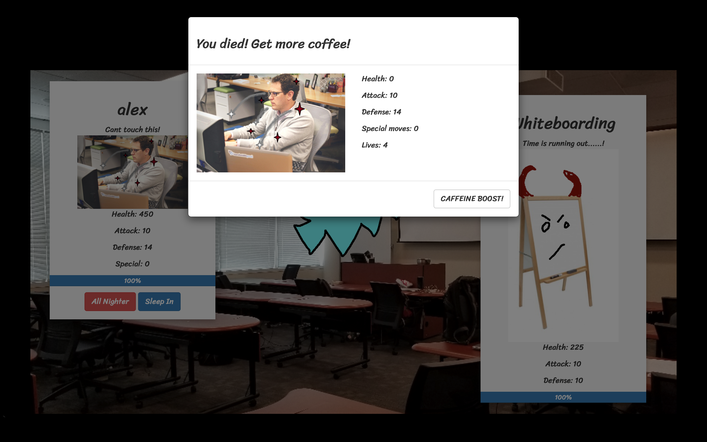
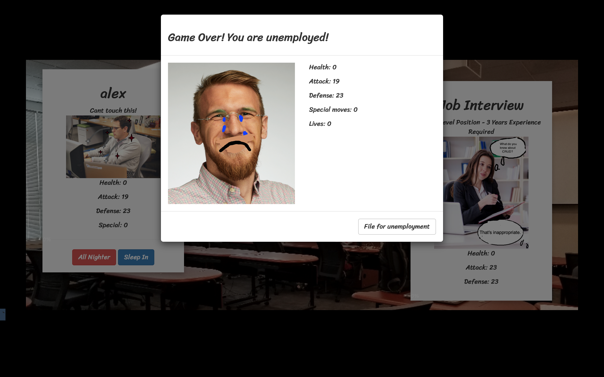

# Full Stack Attack 

Get ready for a riveting journey through a full stack development bootcamp in this turn based RPG. The user logs in and then selects a premade role to play that is supplied by the database. The chosen role assigns the user a set number of attributes like Health, Attack, Defense and Specials. The user battles against one enemy at a time who also has a set number of attributes. The user battles through 17 rounds each with a unique enemy and only then wins the game.

## Getting Started

* Login if you are already a user, or create a new user profile if you are a new user. 
* Pick a character to play as. 
* Once you pick your character the first battle will begin!
* Use the Attack button to use a regular attack on the new technology. 
* Use the All Nighter button to add strength to your attack. This is a special attack!
* Use the Sleep-In button to add to your overall health. This is a special attack!
* You can only have 10 special attacks, so use them wisely. 

## Built With

* [Bootstrap](https://getbootstrap.com/docs/4.3/getting-started/introduction/)
* [jQuery](https://api.jquery.com/)
* [Node.js](https://nodejs.org/en/docs/)
* [Express.js](https://expressjs.com/en/starter/installing.html)
* [Sequelize](http://docs.sequelizejs.com/)
* [MySQL](https://dev.mysql.com/doc/)
* [Anime.js](https://animejs.com/documentation/)

## Authors

* Anna Perkins  
* Taylor Wood
* Tyler Mathena
* Alex Eversbusch

## Version

V1.0

## What we learned from Full Stack Attack
* By defining a scope which seemed attainable in less time than the allowed time for the project, we were able to spend more time on animations, sound effects, and front-end styling. Most importantly we gave ourselves plenty of time to deploy, and make small tweaks to the player stats and game battle logic in order to make it more challenging and fun.       

## What's Next for Full Stack Attack?
* Improve UI for all mobile devices. The current UI is tailored to landscape mode on an iPhoneX. 
* Update player stats in the database, and provide more difficult versions of the game for stronger players to play through. 
* Allow players to buy more lives and more special attacks in a store. 
* Allow players to add their own picture and make their own profile. 
* Allow for deletion of profile. 
* Encripted login system using bcrypt or similar. 

## Characters

* Full Stack Developer 

* Front End Developer

* Back End Developer 

* Teaching Assistant

* Instructor

## Opponents You Will Battle
# $10,000 Dollars
* "Your initial barrier of entry: Tuition!"

# Git
* "Oh Shit, Git! Prepare to be version controlled!"

# HTML
* "Hyper Traumatic Murder League!"

# CSS
* "Killing you with style!"

# Bootstrap
* "Time to flex-box the heavy weight champion!"

# JavaScript
* "Maim || Kill"

# jQuery
* "Prepare to be manipulated by your DOM!"

# Whiteboarding
* "Time is running out......!"

# Node.js
* "npm i bruises!"

# Express.js
* "Hop on the pain train!"

# MySQL
* "Im gonna make you SQL like a pig!"

# Group Projects
* "Im the MVP!"

# GitHub Merge Conflicts
* "No I'm the MVP! Git push -f origin master"

# Sequelize
* "Player.DESTROY!"

# MongoDB
* "404 Enemy Not Found!"

# React.js
* "You're at the end of your Lifecycle!"

# Job Interview
* "Entry Level Position - 3 Years Experience Required"

## Deployment

This app is deployed using heroku and jawsDB.

## Built With

* [Bootstrap](https://getbootstrap.com/docs/4.3/getting-started/introduction/)
* [jQuery](https://api.jquery.com/)
* [Node.js](https://nodejs.org/en/docs/)
* [Express.js](https://expressjs.com/en/starter/installing.html)
* [Sequelize](http://docs.sequelizejs.com/)
* [MySQL](https://dev.mysql.com/doc/)
* [Anime.js](https://animejs.com/documentation/)

## Authors

* Anna Perkins  
* Taylor Wood
* Tyler Mathena
* Alex Eversbusch

## Version

V1.0

## Screenshots
## Log In

## Choose Character

## Attack!

## All-Nighter!

## Sleep-In!

## Next Round Modal

## Player Dead (But Not Out Of Lives) Modal

## Game Over Page

## Game Win Page

